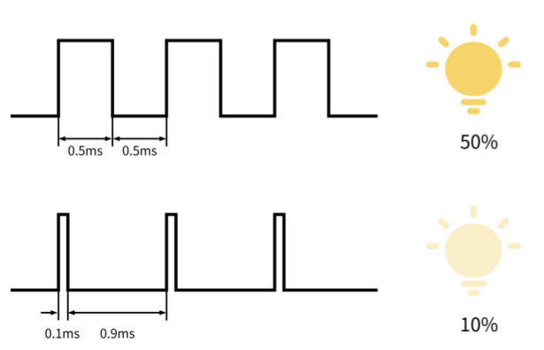
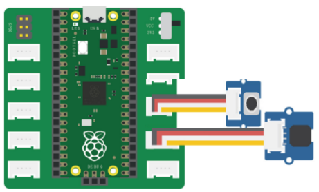
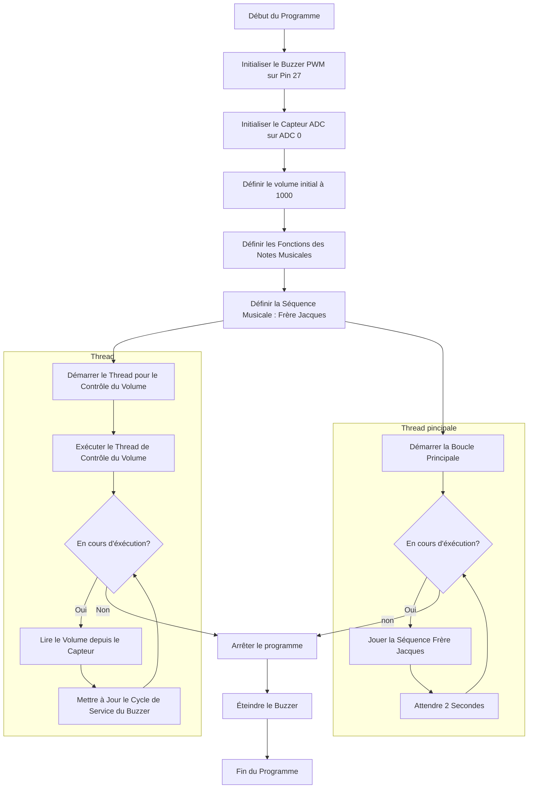

# AD-PWM

## Objectif

Développer un programme en MicroPython pour ajuster le volume d'une mélodie jouée sur un buzzer, avec le contrôle du volume assuré par un potentiomètre.

## Liste de matériel

- Microcontrôleur compatible MicroPython (Raspberry Pi Pico)
- Module potentiomètre
- Buzzer
- Câbles

## Principe

### PWM

Le PWM (Pulse Width Modulation), ou modulation de largeur d'impulsion, est une technique utilisée pour contrôler la puissance envoyée à un dispositif électronique (comme un moteur, une LED ou un buzzer) en modulant la durée pendant laquelle un signal reste actif.   La fréquence du signal PWM détermine la rapidité avec laquelle il oscille entre haut et bas. Une fréquence plus élevée signifie que le cycle de commutation se répète plus souvent par seconde.   Le rapport cyclique représente la proportion de temps pendant laquelle le signal est en état haut par rapport à un cycle complet.

## Cablage

## Diagramme de flux

