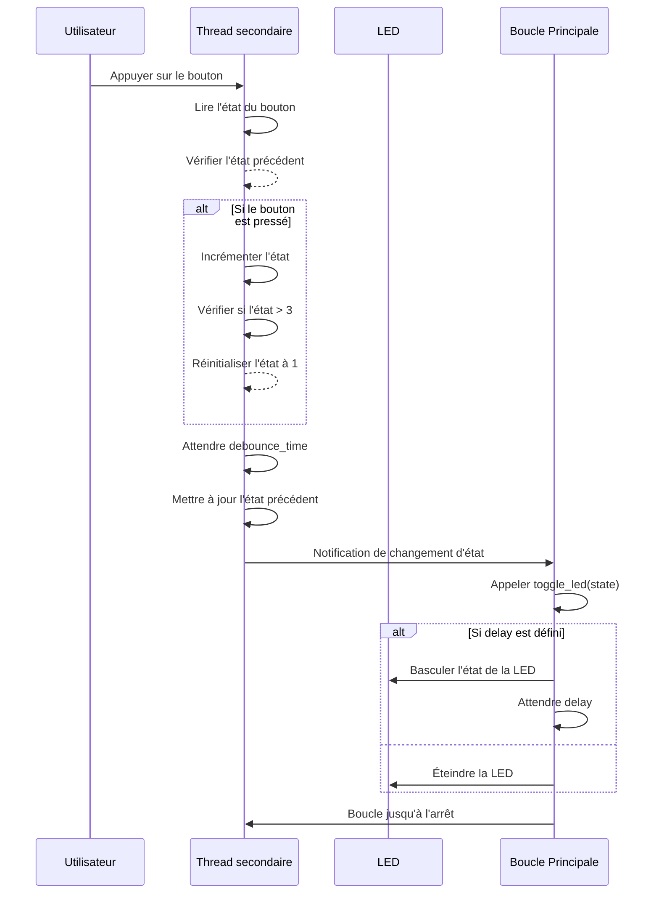

# Exo 1

## Objectif

 Écrire un programme en MicroPython qui fait clignoter une LED à des vitesses variées, en fonction du nombre de fois où l'on appuie sur un bouton poussoir.

# Diagramme de séquence du contrôle de la LED

Acteurs principaux :
        - Utilisateur : Appuie sur le bouton poussoir pour changer la vitesse de clignotement.

        - Thread principal : Gère le clignotement de la LED selon l'état.

        - Thread secondaire : Surveille les appuis sur le bouton poussoir et met à jour l'état (state).

        - LED : Clignote à des vitesses différentes selon la valeur de l'état.

