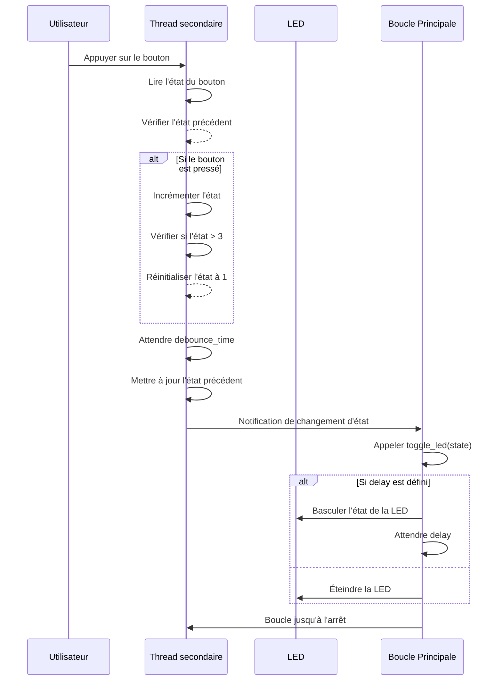
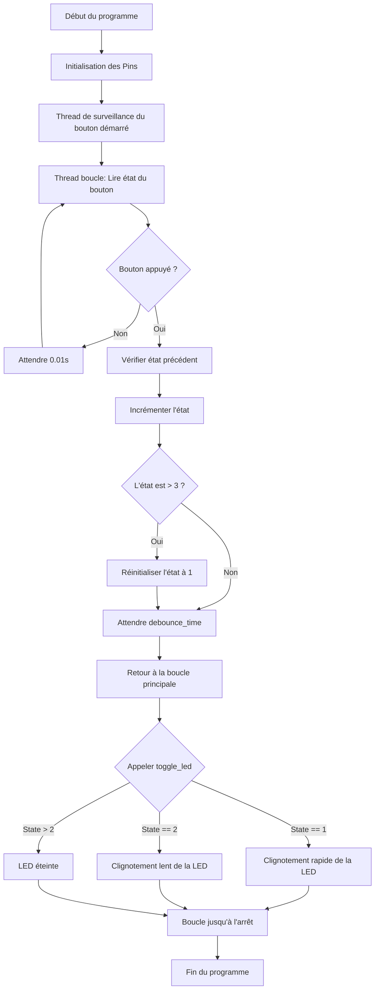

# GPIO

## Objectif

Écrire un programme en MicroPython qui fait clignoter une LED à des vitesses variées, en fonction du nombre de fois où l'on appuie sur un bouton poussoir.

## Liste de matériel

- Raspberry Pi Pico
- LED
- Bouton poussoir
- Cable

## Principe

### Bouton poussoir

Le bouton poussoir est un interrupteur temporaire (il n'agit que s'il est pressé). Il peut avoir deux états : 0 (relâché) ou 1 (appuyé).

Un phénomène de rebond peut apparaître lors de l'utilisation de ceux-ci. Ce phénomène se manifeste lorsqu'un bouton est pressé ou relâché, les contacts mécaniques ne se connectent ou ne se déconnectent pas immédiatement. Ces rebonds peuvent être interprétés comme une nouvelle pression par le programme. Afin de résoudre ce problème, il est possible d'ajouter un délai de quelques millisecondes du côté logiciel.

## Câblage

## Diagramme de séquence du contrôle de la LED

**Acteurs principaux** :

- **Utilisateur** : Appuie sur le bouton poussoir pour changer la vitesse de clignotement.
- **Thread principal** : Gère le clignotement de la LED selon l'état.
- **Thread secondaire** : Surveille les appuis sur le bouton poussoir et met à jour l'état (`state`).
- **LED** : Clignote à des vitesses différentes selon la valeur de l'état.

## Diagramme de flux

