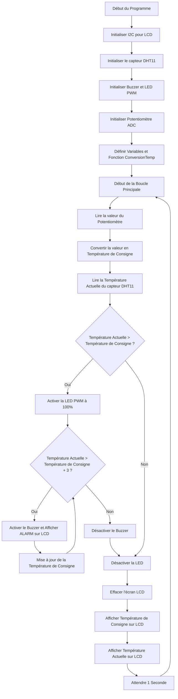

# LCD

## Objectif

Développer un programme en MicroPython pour contrôler un thermostat multi-états.

## Liste de matériel

- Microcontrôleur compatible MicroPython (Raspberry Pi Pico)
- Module capteur température/humidité
- Module LED
- Module potentiomètre
- Module écran LCD
- Module Buzzer
- Câbles

## Principe

### LCD

Un LCD (Liquid Crystal Display) est un écran qui utilise des cristaux liquides pour afficher des informations visuelles, telles que du texte, des chiffres ou des images.  Les critaux liquides ont la capacité de changer leur orientation lorsqu'un courant électrique leur est appliqué. Derrière les cristaux liquides, il y a une source de lumière (rétroéclairage), qui émet de la lumière à travers les cristaux. En modifiant l'orientation des cristaux liquides avec un courant électrique, il est possible de contrôler la quantité de lumière qui passe à travers chaque pixel de l'écran.

### I2C

L'I2C (Inter-Integrated Circuit) est un protocole de communication série qui permet aux microcontrôleurs et autres composants électroniques de communiquer entre eux. Le protocole I2C fonctionne selon un modèle maître-esclave :

- Maître : Le dispositif qui initie et contrôle la communication. Le microcontrôleur joue souvent le rôle de maître.
- Esclaves : Les dispositifs qui reçoivent les commandes du maître.

 L'I2C utilise deux lignes pour la communication :

- SDA (Serial Data Line) : C'est la ligne de données, utilisée pour transmettre les données entre les dispositifs.
- SCL (Serial Clock Line) : C'est la ligne d'horloge, qui synchronise les transmissions de données entre les dispositifs.

## Cablage

## Diagramme de flux

