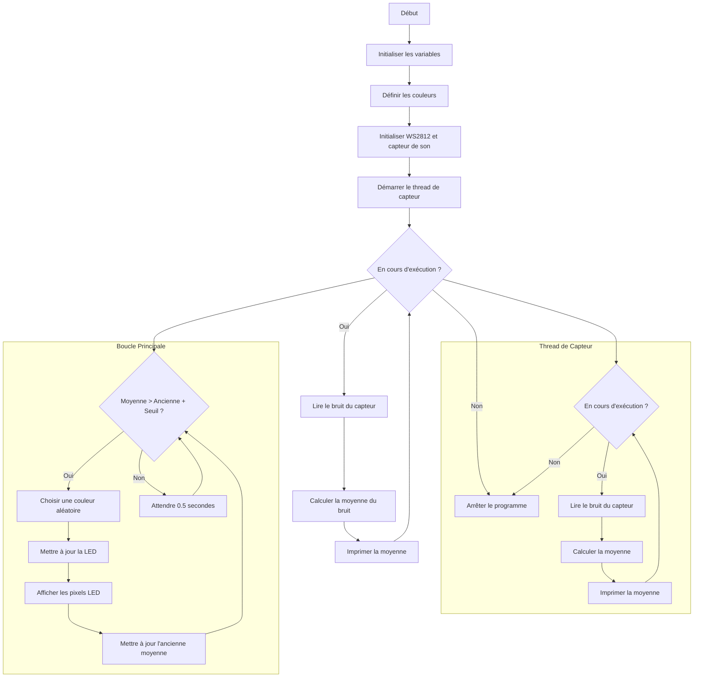

# RYTHM

## Objectif

Ce projet a pour but de créer un script MicroPython capable de contrôler une LED RGB connectée à un Raspberry Pi Pico W, en modifiant sa couleur en synchronisation avec la musique.

## Liste de matériel

- Raspberry Pi Pico W
- Module microphone
- Module LED RGB
- Fils de connexion

## Cablage

## Diagramme de flux

